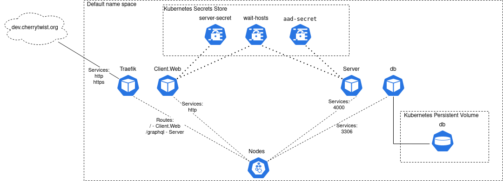

  

<i>Enabling society to collaborate. Building a better future, together.</i>

# Infrastructure
This repository is for managing the creation, deployment and operations of Cherrytwist instances. 

Cherrytwist is architected as a micro-services application, implying:
- **Docker images**: all deployments are based on docker images 
- **Containers onto Kubernetes**: deploying containers based on those docker images onto a kubernetes cluster
- **Kubernetes via Terraform**: the kubertnes cluster is created itself via Terraform 

The core services that are running in a deployment of Cherrytwist include:
- **Cherrytwist Server**: for core data model management and authorisation
- **Cherrytwist Client.Web**: a sample web server that allows browser based navigation of the ecoverse
- **Identity Provider**: currently based on Azure Active Directory
- **Traefik**: A reverse proxy and incoming traffic management for the exposed web endpoints
- **Database**: currently based on MySql, for storing the representation of the Cherrytwist instance

Note: this repository is about creating a production deployment of Cherrytwist. If you are simply looking for getting a test version up and running quickly then you might also want to consider the [Demo](https://github.com/cherrytwist/demo) repository which uses Docker-compose to pull together a simple working example. 

Finally, worth mentioning that as with any automation there is a point of diminishing returns, so there are still some aspects of the Kubernetes cluster that are not fully generated from via Terraform. 
# Current overview of the services that are running on AKS.

# Url mappings
Currently there is one publicly visible deployment environment at [dev.cherrytwist.org](dev.cherrytwist.org). This URL directs traffic to the external ip of our kubernetes cluster, where our ingress controller, Traefik, takes over and routes the incoming request to the correct service. 

Currently there are two endpoints exposed:
- [dev.cherrytwist.org](dev.cherrytwist.org): the web front end to allow browsing of the Cherrytwist instance.
- [dev.cherrytwist.org/graphql](dev.cherrytwist.org/graphql): the graphql api exposed by the server. It can be both directly accessed and it is used by the client web server to obtain the data presented via the browser application. More can be found on the [Cherrytwist Server](https://github.com/cherrytwist/Server/) repo. 

# Orchestration

For creating a production version of Cherrytwist the recommendation is to use a Kubernetes cluster. Currently there are two deployments supported:
* **K8s AKS (Azure Kubernetes Service) Cluster**:  Please look into the [terraform-aks-k8s](terraform-aks-k8s) folder for steps on how to terraform a new cluster on Azure.
* **K8s AWS EKS (Elastic Kubernetes Service) Cluster**: Please look into the [terraform-eks-k8s](terraform-eks-k8s) folder for steps on how to terraform a new cluster on AWS.

# **Additional Information**:

- [Overview of how new container images are published](./docs/publishing-to-container-registries.md)
- [To configure Authentication with Azure Active Directory (AAD)](./docs/configuration-aad-authentication.md)
- [To configure a CDN on Azure (obsolete)](./docs/configuration-cdn-azure.md)
- [To deploy an environment onto Azure](./docs/deploying-on-azure.md)
- [To manage secrets using Secret stores](./docs/secret-stores.md)
- [To add / update Github actions](./docs/github-actions.md)

