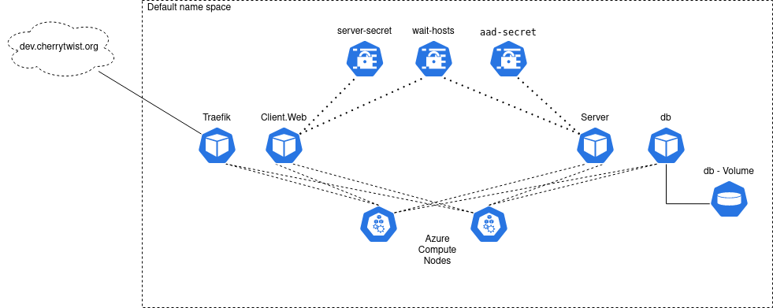

# Infrastructure
Creates deployments, managing infrastructure scripts, devops, monitoring, ...

# Diagram of K8s deployment




# Url mappings
Currently we are only using [dev.cherrytwist.org](dev.cherrytwist.org). This is pointed to the external ip of our kubernetes cluster. This is where traefik as our ingress controller takes over and routes the incoming request to the correct service. 

Currently there are two routes:
- [dev.cherrytwist.org](dev.cherrytwist.org) This loads the main page for cherrytwist with the appropriate challenges.
- [dev.cherrytwist.org/graphql](dev.cherrytwist.org/graphql) This is the graphql api endpoint for clients to connect to for access to the cherrytwist api. More can be found on the [CherryTwist Server](https://github.com/cherrytwist/Server/) repo. 

# K8s Cluster
To start using CherryTwist one needs to spin up a kubernetes cluster. Please look into the [terraform-aks-k8s](terraform-aks-k8s) folder for steps on how to terraform a new cluster on azure.

# To Connect to K8s
- A recommendation is the use the `lens` Kube IDE for connection: `https://github.com/lensapp/lens`
- Download and log into azure cli `az --login`
- Next run `az aks get-credentials --resource-group azure-k8s-dev --name k8s-dev` to get your kube creds

# To Deploy:

- Download and log into azure cli `az --login`
- Go into `terraform-aks-k8s` directory.
- Edit the `variables.tf` file to your desired state.
- Run `terraform init` if this is your first run.
- Run `terraform plan -out out.plan`
- Look over the output
- Run `terraform apply "out.plan"`
- This will now build the full k8s deployment in azure
- Next run `az aks get-credentials --resource-group azure-k8s-dev --name k8s-dev` to get your kube creds
- Let aks talk with the acr run `az aks update -n k8s-dev -g azure-k8s-dev --attach-acr ctdev`
- cd into traefik directory `cd ../traefik`
- Read the ReadMe.md that is located in that directory.
- Create the secret for mySQL and GraphQL sensitive information (sample with default values).
```
kubectl create secret generic server-secret --from-literal=DATABASE_HOST='db' --from-literal=MYSQL_DATABASE='cherrytwist' --from-literal=MYSQL_ROOT_PASSWORD='toor' --from-literal=GRAPHQL_ENDPOINT_PORT='4000' --from-literal=GRAPHQL_SERVER_ENDPOINT_URL='ct-server-service.default'
```
- Create the secret for WAIT_HOSTS values (sample with default values).
```
kubectl create secret generic wait-hosts --from-literal=WAIT_HOSTS='db.default:3306' --from-literal=WAIT_HOSTS_TIMEOUT='300' --from-literal=WAIT_SLEEP_INTERVAL='30' --from-literal=WAIT_HOSTS_CONNECT_TIMEOUT='30' 
```

# To Update Github Actions:
- Create an Azure role assignment for the scope of your Azure subscription and resource group.
```
az ad sp create-for-rbac --sdk-auth --role contributor --scopes /subscriptions/{subscription id}/resourceGroups/azure-k8s-dev
```
- Go to the organizational secrets and update the secret `AZURE_CRED_K8S` with the output of the previous command

# Secrets and secret stores
There are two main types of secretes in this project concurring infrastructure. The first is the secrets that are stored in Githubs secret store. These secrets are used in the github actions to push/pull containers from the azure container registry, deploy containers to kubernetes, and to run deployment manifests on kubernetes. These secrets are added when a new container registry or kuberneties cluster is created as they require current RBAC to access their needed resources. 

For connecting github acctions to the acr a brief set of steps are proved. For more details please see the [ms docs](https://docs.microsoft.com/en-us/azure/container-instances/container-instances-github-action):
- Create service principal for Azure authentication
  - `groupId=$(az group show \
     --name <resource-group-name> \
     --query id --output tsv)`
  - `az ad sp create-for-rbac \
     --scope $groupId \
     --role Contributor \
     --sdk-auth`
  - Save the output for later
- Update service principal for registry authentication
  - `registryId=$(az acr show \
     --name <registry-name> \
     --query id --output tsv)`
  - `az role assignment create \
     --assignee <ClientId> \
     --scope $registryId \
     --role AcrPush`
- Save credentials to GitHub repo
  - AZURE_CREDENTIALS: The entire JSON output from the service principal creation step
  - REGISTRY_LOGIN_SERVER: The login server name of your registry (all lowercase). Example: myregistry.azurecr.io
  - REGISTRY_USERNAME: The clientId from the JSON output from the service principal creation
  - REGISTRY_PASSWORD: The clientSecret from the JSON output from the service principal creation
  - RESOURCE_GROUP: The name of the resource group you used to scope the service principal

A brief overview to add rbac from acr to aks, see [ms docs here](https://docs.microsoft.com/en-us/azure/aks/cluster-container-registry-integration) for more info:
- `az aks update -n myAKSCluster -g myResourceGroup --attach-acr <acr-name>`

The second set of secretes for the infrastructure is in the kubernetes deployment. These are used for inter-service communication / authentication. These have been described above in the deployment steps.

# TODO's / Improvements 
This is still a work in progress where things need to be automated and built out. 

- Terraform github secrets that are used in github actions. When a new kubernetes cluster is created then several secretes need to be added / updated in the CherryTwist org level secret store. This is currently done manually but should be automated with the deployment.
- Terraform the updating of dns records. When traefik is created it will obtain a public ip address, this address needs to be accosted with the correct dns record. Currently this is done using a manual process and should be automated.
- Add the Terraform state file to a shared storage container.
- Terraform the container registry and the needed RBAC for access from AKS.
