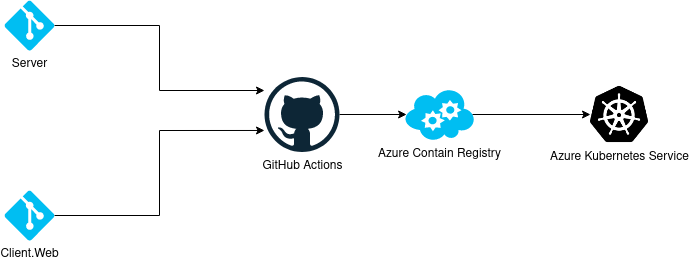

# Infrastructure
This repository is for managing the creation, deployment and operations of Cherrytwist instances. 

Cherrytwist is architected as a micro-services application, implying:
- **Docker images**: all deployments are based on docker images 
- **Containers onto Kubernetes**: deploying containers based on those docker images onto a kubernetes cluster
- **Kubernetes via Terraform**: the kubertnes cluster is created itself via Terraform 

The core services that are running in a deployment of Cherrytwist include:
- **Cherrytwist Server**: for core data model management and authorisation
- **Cherrytwist Client.Web**: a sample web server that allows browser based navigation of the ecoverse
- **Identity Provider**: currently based on Azure Active Directory
- **Traefik**: A reverse proxy and incoming traffic management for the exposed web endpoints
- **Database**: currently based on MySql, for storing the representation of the Cherrytwist instance

Note: this repository is about creating a production deployment of Cherrytwist. If you are simply looking for getting a test version up and running quickly then you might also want to consider the [Demo](https://github.com/cherrytwist/demo) repository which uses Docker-compose to pull together a simple working example. 

Finally, worth mentioning that as with any automation there is a point of diminishing returns, so there are still some aspects of the Kubernetes cluster that are not fully generated from via Terraform. 

# Diagram of K8s deployment
##### Current overview of workflow between github, ACR, and AKS.


##### Current overview of the services that are running on AKS.


# Url mappings
Currently there is one publicly visible deployment environment at [dev.cherrytwist.org](dev.cherrytwist.org). This URL directs traffic to the external ip of our kubernetes cluster, where our ingress controller, Traefik, takes over and routes the incoming request to the correct service. 

Currently there are two endpoints exposed:
- [dev.cherrytwist.org](dev.cherrytwist.org): the web front end to allow browsing of the Cherrytwist instance.
- [dev.cherrytwist.org/graphql](dev.cherrytwist.org/graphql): the graphql api exposed by the server. It can be both directly accessed and it is used by the client web server to obtain the data presented via the browser application. More can be found on the [Cherrytwist Server](https://github.com/cherrytwist/Server/) repo. 

# K8s Cluster
For creating a production version of Cherrytwist the recommendation is to use a Kubernetes cluster. Please look into the [terraform-aks-k8s](terraform-aks-k8s) folder for steps on how to terraform a new cluster on azure.

# To Connect to K8s
- A recommendation is the use the `lens` Kube IDE for connection: `https://github.com/lensapp/lens`
- Download and log into azure cli `az --login`
- Next run `az aks get-credentials --resource-group azure-k8s-dev --name k8s-dev` to get your kube creds

# To Configure Authentication with Azure Active Directory (AAD)

## Register the web client

1. Navigate to the Microsoft identity platform for developers [App registrations](https://go.microsoft.com/fwlink/?linkid=2083908) page.
1. Select **New registration**.
   
1. When the **Register an application page** appears, enter your application's registration information:
   - In the **Name** section, enter a meaningful application name that will be displayed to users of the app, for example `cherrytwist-web`.
   - Change **Supported account types** to **Accounts in any organizational directory and personal Microsoft accounts (e.g. Skype, Xbox, Outlook.com)**.
   - Select **Register** to create the application.
      
1. On the app **Overview** page, find the **Application (client) ID** value and record it for later. You'll need it to configure the configuration file for this projects. It will be used as the **REACT_APP_AUTH_CLIENT_ID** environment variable value in the Cherrytwist Client App. Record the **Directory (tenant) ID**. It will be used as the **REACT_APP_AUTH_TENANT_ID** environment variable in the Cherrytwist Client App.
      
1. From the app's Overview page, select the **Authentication** section.
   - Click **Add a platform** button.
   - Select **Single-page Applications** on the right blade.
   - Add a **Redirect URIs**, for example for local usage `http://localhost:3000` or for production deployment `https://dev.cherrytwist.org`. You can use multiple redirect uris for your configuration.
   - Click **Configure**.
      
   - Record the **Redirect URI**. It will be used as the **REACT_APP_AUTH_REDIRECT_URI** environment variable value in the Cherrytwist Client App.
1. Select the **Token configuration** section, and:
   - Click **Add optional claim**
   - Select **Access** Token type
   - Select **email** Token type
   - Click **Add**

   
   **Note: the step is the same as in the api so the same image is used**

## Register the backend GraphQL server

1. Navigate to the Microsoft identity platform for developers [App registrations](https://go.microsoft.com/fwlink/?linkid=2083908) page.
1. Select **New registration**.
   
1. When the **Register an application page** appears, enter your application's registration information:
   - In the **Name** section, enter a meaningful application name that will be displayed to users of the app, for example `cherrytwist-api`.
   - Change **Supported account types** to **Accounts in any organizational directory and personal Microsoft accounts (e.g. Skype, Xbox, Outlook.com)**.
   - Select **Register** to create the application.
   
1. On the app **Overview** page, find the **Application (client) ID** value and record it for later. You'll need it to configure the configuration file for this projects. It is the **AAD_CLIENT** environment variable used in the CT Server project. **Directory (tenant) ID** is the **AAD_TENANT** environment variable.
   
1. Select the **API permissions** section
   - Click the **Add a permission** button and then,
   - Ensure that the **Microsoft APIs** tab is selected
   - In the _Commonly used Microsoft APIs_ section, click on **Microsoft Graph**
   - In the **Delegated permissions** section, ensure that the right permissions are checked: **User.Read**, **offline_access**, **openid**, **email**. Use the search box if necessary.
   - Select the **Add permissions** button.
   
1. Select the **Expose an API** section, and:
   - Click **Set** next to the Application ID URI to generate a URI that is unique for this app (in the form of `api://{clientId}`).
   - Select **Add a scope**
   - Enter the following parameters
     - for **Scope name** use `Cherrytwist-GraphQL`
     - Keep **Admins and users** for **Who can consent**
     - in **Admin consent display name** type `Access Cherrytwist GraphQL API`
     - in **Admin consent description** type `Access Cherrytwist GraphQL API`
     - in **User consent display name** type `Access Cherrytwist GraphQL API`
     - in **User consent description** type `Access Cherrytwist GraphQL API`
     - Keep **State** as **Enabled**
     - Select **Add scope**
   - Record the **Application ID URI**. It will be used (in the form of [application id uri]/.default) as the **REACT_APP_AUTH_API_SCOPE** environment variable in the Cherrytwist client
   
1. From the **Expose an API** menu, click the **Add a client application**. Select the **Application (client) ID** of the `cherrytwist-web` application copied from the Azure portal and select the scope you created in the previous step.
   
1. Select the **Token configuration** section, and:
   - Click **Add optional claim**
   - Select **Access** Token type
   - Select **email** Token type
   - Click **Add**

   
1. Go back to cherrytwist-web and select the **API permissions** section
   - Click the **Add a permission** button and then,
   - Ensure that the **My APIs** tab is selected
   - In the list of APIs, select the `cherrytwist-api` API, or the name you entered for the Web API
   - In the **Delegated permissions** section, ensure that the right permissions are checked: **Access Cherrytwist GraphQL API**. Use the search box if necessary.
   - Select the **Add permissions** button.
   

## Extending the workflow and authenticating with other OIDC + OAuth 2.0 workflows

1. If you'd like to use another OAuth 2.0 / OIDC workflow and would like to use the OIDC metadata document or the OAuth 2.0 v2 endpoints:

   - Go to cherrytwist-web / cherrytwist-api app registration
   - Click Endpoints


# To Deploy

- Download and log into azure cli `az --login`
- Go into `terraform-aks-k8s` directory.
- Edit the `variables.tf` file to your desired state.
- Run `terraform init` if this is your first run.
- Run `terraform plan -out out.plan`
- Look over the output
- Run `terraform apply "out.plan"`
- This will now build the full k8s deployment in azure
- Next run `az aks get-credentials --resource-group azure-k8s-dev --name k8s-dev` to get your kube creds
- Let aks talk with the acr run `az aks update -n k8s-dev -g azure-k8s-dev --attach-acr ctdev`
- cd into traefik directory `cd ../traefik`
- Read the ReadMe.md that is located in that directory.
- Create the secret for mySQL and GraphQL sensitive information (sample with default values).
```
kubectl create secret generic server-secret --from-literal=DATABASE_HOST='db' --from-literal=MYSQL_DATABASE='cherrytwist' --from-literal=MYSQL_ROOT_PASSWORD='toor' --from-literal=GRAPHQL_ENDPOINT_PORT='4000' --from-literal=GRAPHQL_SERVER_ENDPOINT_URL='ct-server-service.default' 
```
- Create the secret for WAIT_HOSTS values (sample with default values).
```
kubectl create secret generic wait-hosts --from-literal=WAIT_HOSTS='db.default:3306' --from-literal=WAIT_HOSTS_TIMEOUT='300' --from-literal=WAIT_SLEEP_INTERVAL='30' --from-literal=WAIT_HOSTS_CONNECT_TIMEOUT='30' 
```
- Create a secret for AAD values (Sample with items between <> needing to be replaces). In this example we have two AAD called cherrytwist-web and one called cherrytwist-api. 
```
kubectl create secret generic aad-secret --from-literal=REACT_APP_AUTH_CLIENT_ID='<CLIENT_ID from cherrytwist-web >' --from-literal=REACT_APP_AUTH_TENANT_ID='<TENANT_ID from cherrytwist-web>' --from-literal=REACT_APP_AUTH_API_SCOPE='<api://[cherrytwist-api-client-id]/.default>' --from-literal=AAD_TENANT='<tenant id from cherrytwist-api>' --from-literal=AAD_CLIENT='<client id from cherrytwist-api>'
```
- Create a secret for the server authentication flag that will turn AAD auth on or off.
```
kubectl create secret generic authentication --from-literal=AUTHENTICATION_ENABLED='true'
```

# To Update Github Actions
- Create an Azure role assignment for the scope of your Azure subscription and resource group.
```
az ad sp create-for-rbac --sdk-auth --role contributor --scopes /subscriptions/{subscription id}/resourceGroups/azure-k8s-dev
```
- Go to the organizational secrets and update the secret `AZURE_CRED_K8S` with the output of the previous command

# Secrets and secret stores
There are two main types of secretes in this project concurring infrastructure. The first is the secrets that are stored in Githubs secret store. These secrets are used in the github actions to push/pull containers from the azure container registry, deploy containers to kubernetes, and to run deployment manifests on kubernetes. These secrets are added when a new container registry or kuberneties cluster is created as they require current RBAC to access their needed resources. 

For connecting github acctions to the acr a brief set of steps are proved. For more details please see the [ms docs](https://docs.microsoft.com/en-us/azure/container-instances/container-instances-github-action):
- Create service principal for Azure authentication
  - `groupId=$(az group show \
     --name <resource-group-name> \
     --query id --output tsv)`
  - `az ad sp create-for-rbac \
     --scope $groupId \
     --role Contributor \
     --sdk-auth`
  - Save the output for later
- Update service principal for registry authentication
  - `registryId=$(az acr show \
     --name <registry-name> \
     --query id --output tsv)`
  - `az role assignment create \
     --assignee <ClientId> \
     --scope $registryId \
     --role AcrPush`
- Save credentials to GitHub repo
  - AZURE_CREDENTIALS: The entire JSON output from the service principal creation step
  - REGISTRY_LOGIN_SERVER: The login server name of your registry (all lowercase). Example: myregistry.azurecr.io
  - REGISTRY_USERNAME: The clientId from the JSON output from the service principal creation
  - REGISTRY_PASSWORD: The clientSecret from the JSON output from the service principal creation
  - RESOURCE_GROUP: The name of the resource group you used to scope the service principal

A brief overview to add rbac from acr to aks, see [ms docs here](https://docs.microsoft.com/en-us/azure/aks/cluster-container-registry-integration) for more info:
- `az aks update -n myAKSCluster -g myResourceGroup --attach-acr <acr-name>`

The second set of secretes for the infrastructure is in the kubernetes deployment. These are used for inter-service communication / authentication. These have been described above in the deployment steps.

# TODO's / Improvements 
The following aspects of the creation of the Kubernetes environment from Terraform are currently manual and are candidates for later automation:
- Terraform github secrets that are used in github actions. When a new kubernetes cluster is created then several secretes need to be added / updated in the Cherrytwist org level secret store. This is currently done manually but should be automated with the deployment.
- Terraform the updating of dns records. When traefik is created it will obtain a public ip address, this address needs to be accosted with the correct dns record. Currently this is done using a manual process and should be automated.
- Add the Terraform state file to a shared storage container.
- Terraform the container registry and the needed RBAC for access from AKS.
