# To Configure Authentication with Azure Active Directory (AAD)

## Register the web client

1. Navigate to the Microsoft identity platform for developers [App registrations](https://go.microsoft.com/fwlink/?linkid=2083908) page.
1. Select **New registration**.
   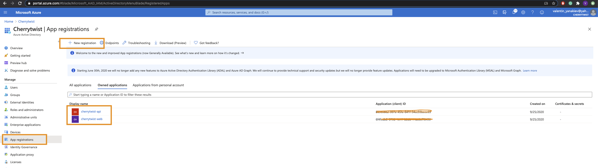
1. When the **Register an application page** appears, enter your application's registration information:
   - In the **Name** section, enter a meaningful application name that will be displayed to users of the app, for example `cherrytwist-web`.
   - Change **Supported account types** to **Accounts in any organizational directory and personal Microsoft accounts (e.g. Skype, Xbox, Outlook.com)**.
   - Select **Register** to create the application.
      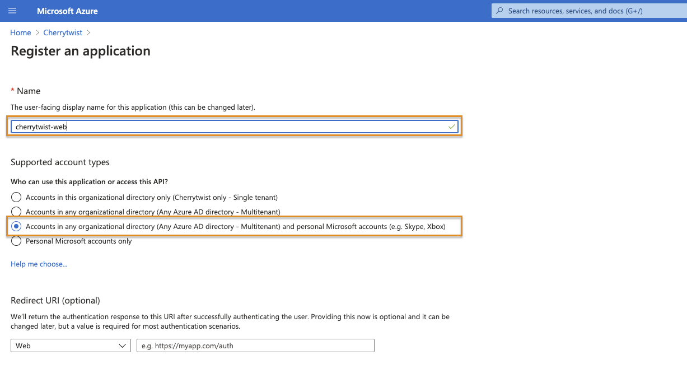
1. On the app **Overview** page, find the **Application (client) ID** value and record it for later. You'll need it to configure the configuration file for this projects. It will be used as the **REACT_APP_AUTH_CLIENT_ID** environment variable value in the Cherrytwist Client App. Record the **Directory (tenant) ID**. It will be used as the **REACT_APP_AUTH_TENANT_ID** environment variable in the Cherrytwist Client App.
      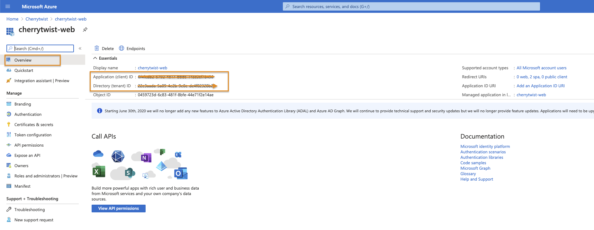
1. From the app's Overview page, select the **Authentication** section.
   - Click **Add a platform** button.
   - Select **Single-page Applications** on the right blade.
   - Add a **Redirect URIs**, for example for local usage `http://localhost:3000` or for production deployment `https://dev.cherrytwist.org`. You can use multiple redirect uris for your configuration.
   - Click **Configure**.
      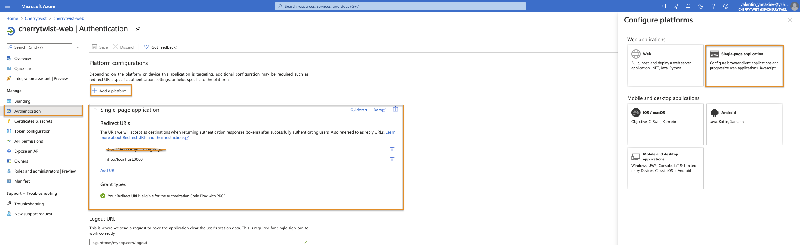
   - Record the **Redirect URI**. It will be used as the **REACT_APP_AUTH_REDIRECT_URI** environment variable value in the Cherrytwist Client App.
1. Select the **Token configuration** section, and:
   - Click **Add optional claim**
   - Select **Access** Token type
   - Select **email** Token type
   - Click **Add**

   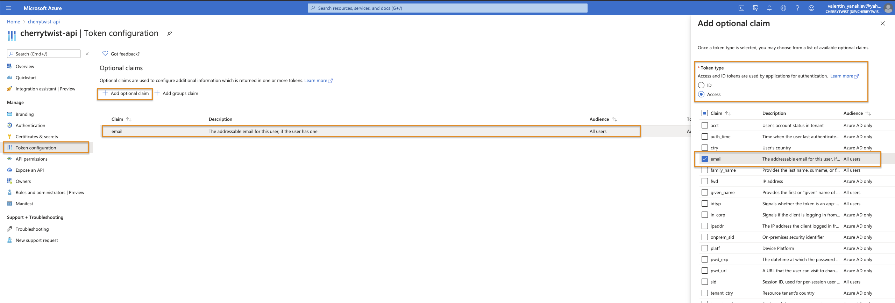
   **Note: the step is the same as in the api so the same image is used**

## Register the backend GraphQL server

1. Navigate to the Microsoft identity platform for developers [App registrations](https://go.microsoft.com/fwlink/?linkid=2083908) page.
1. Select **New registration**.
   
1. When the **Register an application page** appears, enter your application's registration information:
   - In the **Name** section, enter a meaningful application name that will be displayed to users of the app, for example `cherrytwist-api`.
   - Change **Supported account types** to **Accounts in any organizational directory and personal Microsoft accounts (e.g. Skype, Xbox, Outlook.com)**.
   - Select **Register** to create the application.
   
1. On the app **Overview** page, find the **Application (client) ID** value and record it for later. You'll need it to configure the configuration file for this projects. It is the **AAD_CLIENT** environment variable used in the CT Server project. **Directory (tenant) ID** is the **AAD_TENANT** environment variable.
   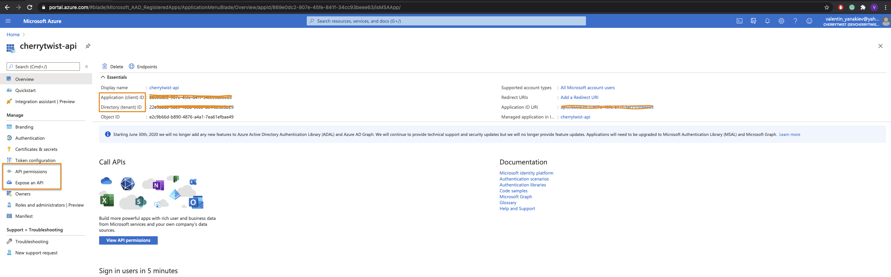
1. Select the **API permissions** section
   - Click the **Add a permission** button and then,
   - Ensure that the **Microsoft APIs** tab is selected
   - In the _Commonly used Microsoft APIs_ section, click on **Microsoft Graph**
   - In the **Delegated permissions** section, ensure that the right permissions are checked: **User.Read**, **offline_access**, **openid**, **email**. Use the search box if necessary.
   - Select the **Add permissions** button.
   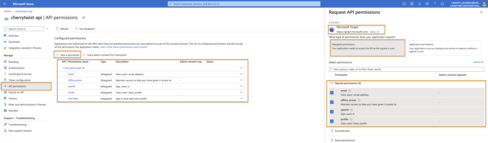
1. Select the **Expose an API** section, and:
   - Click **Set** next to the Application ID URI to generate a URI that is unique for this app (in the form of `api://{clientId}`).
   - Select **Add a scope**
   - Enter the following parameters
     - for **Scope name** use `Cherrytwist-GraphQL`
     - Keep **Admins and users** for **Who can consent**
     - in **Admin consent display name** type `Access Cherrytwist GraphQL API`
     - in **Admin consent description** type `Access Cherrytwist GraphQL API`
     - in **User consent display name** type `Access Cherrytwist GraphQL API`
     - in **User consent description** type `Access Cherrytwist GraphQL API`
     - Keep **State** as **Enabled**
     - Select **Add scope**
   - Record the **Application ID URI**. It will be used (in the form of [application id uri]/.default) as the **REACT_APP_AUTH_API_SCOPE** environment variable in the Cherrytwist client
   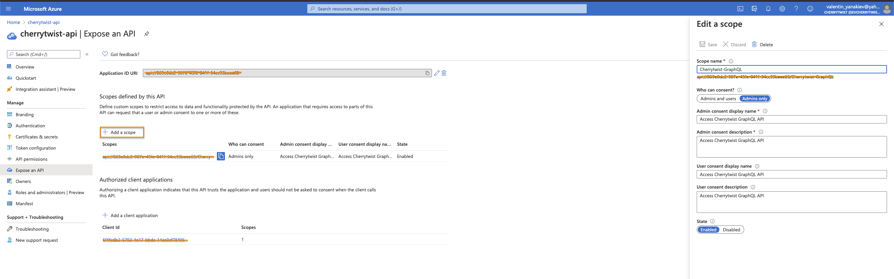
1. From the **Expose an API** menu, click the **Add a client application**. Select the **Application (client) ID** of the `cherrytwist-web` application copied from the Azure portal and select the scope you created in the previous step.
   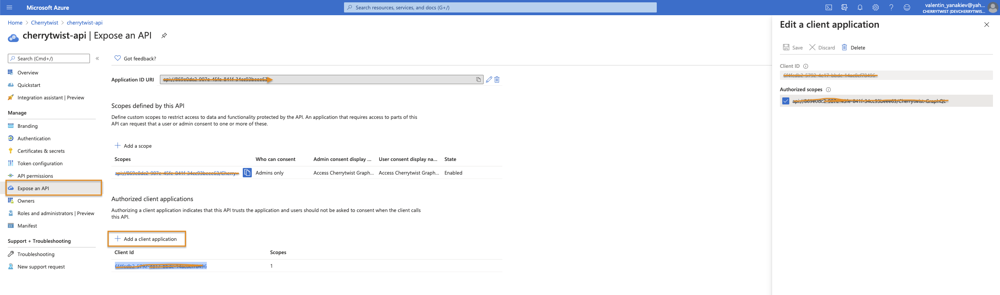
1. Select the **Token configuration** section, and:
   - Click **Add optional claim**
   - Select **Access** Token type
   - Select **email** Token type
   - Click **Add**

   
1. Go back to cherrytwist-web and select the **API permissions** section
   - Click the **Add a permission** button and then,
   - Ensure that the **My APIs** tab is selected
   - In the list of APIs, select the `cherrytwist-api` API, or the name you entered for the Web API
   - In the **Delegated permissions** section, ensure that the right permissions are checked: **Access Cherrytwist GraphQL API**. Use the search box if necessary.
   - Select the **Add permissions** button.
   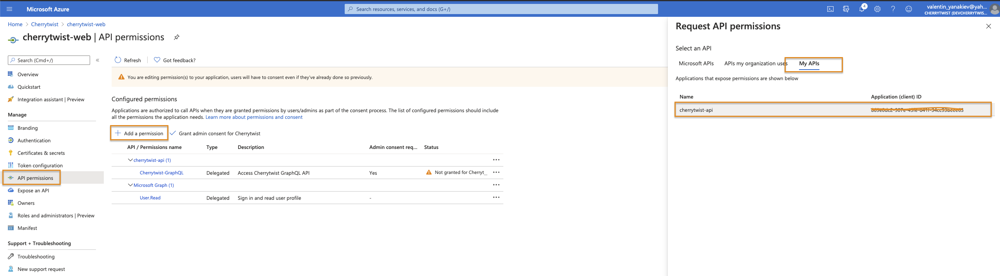

## Extending the workflow and authenticating with other OIDC + OAuth 2.0 workflows

1. If you'd like to use another OAuth 2.0 / OIDC workflow and would like to use the OIDC metadata document or the OAuth 2.0 v2 endpoints:

   - Go to cherrytwist-web / cherrytwist-api app registration
   - Click Endpoints
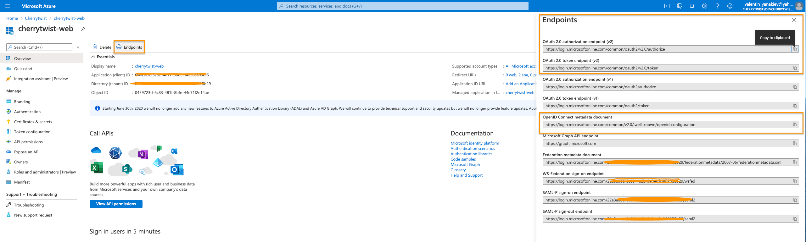
