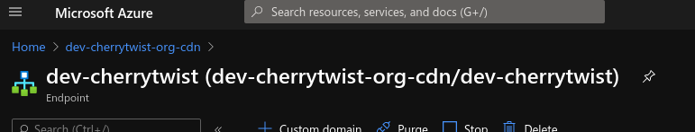
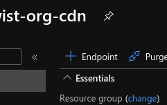
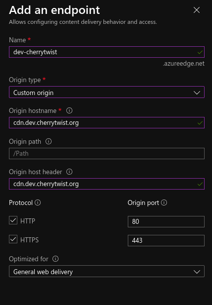
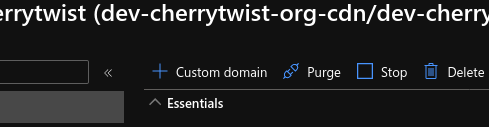
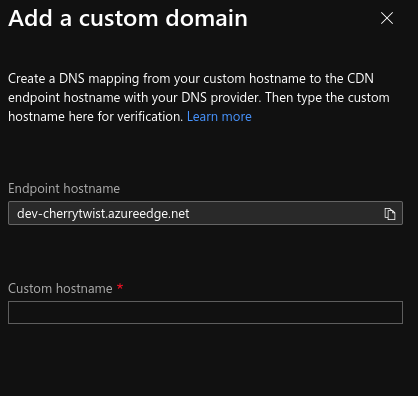

# To Configure CDN 
The current CDN endpoint is pointing to `https://dev-cherrytwist.azureedge.net` with the custom domain at `cdn.dev.cherrytwist.org`. 

## Setting up CDN
1. Create a CDN endpoint on Azure portal. 
   
1. Click on " + Endpoint" to create a new endpoint for the CDN. This will be the incoming url taht needs to be added to the application. One must also create a DNS record to point to either this endpoint or to the custom domain added in the later steps.
   
1. Fill in the information with the values for the endpoint that one is trying ot setup. The example bellow should help: 
   
1. If one would like to have to CDN be connected to a custom domin one needs to setup the DNS records and then click "Custom domain". This should be located on the CDN page for the endpoint what was created above.
   
1. Add a "Custom hostname" to the application as one setup in the DNS record. Once this last step is complet the application needs to be adjusted to use this endpoint.

